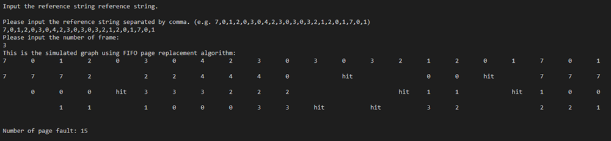

# Page Replacement Algorithms

These python scripts are used to simulate the page replacement algorithms in operating systems.
A simulated graph (as below) and number of page fault will be generated to demonstrate page replacement algorithms

Here is the example output of the `FIFO.py`:

They can be run on the command line or any python IDE that you prefer. Please input the approximate according to the instructions after you run the script.. 
These python script are built by Python3 and some libraries (e.g. pandas, queue, operator, collections)

## Description

## `FIFO.py`
---
It is used to demonstrate the First-In-First-Out (FIFO) Algorithm. In this algorithm, operating system keeps track of all pages in the memory in a queue, oldest page is in the front of the queue. When a page needs to be replaced page in the front of the queue is selected for removal.

## `Optimal.py`
---
It is used to demonstrate the Optimal Algorithm. In this algorithm, OS replaces the page that will not be used for the longest period of time in future.

## `LRU.py`
---
It is used to demonstrate the Least Recently Used (LRU) Algorithm. In this algorithm, OS replaces page that has not been in the most amount of time.